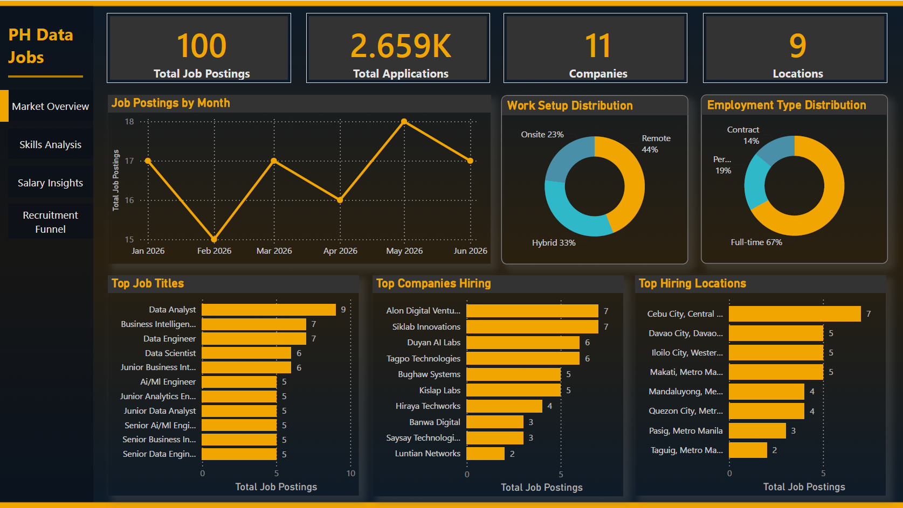
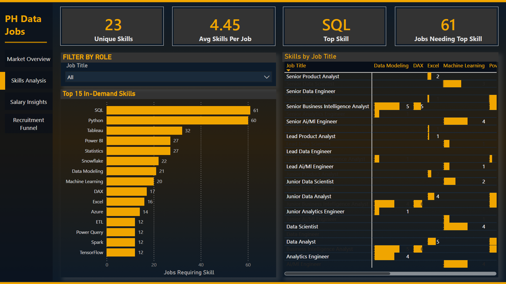
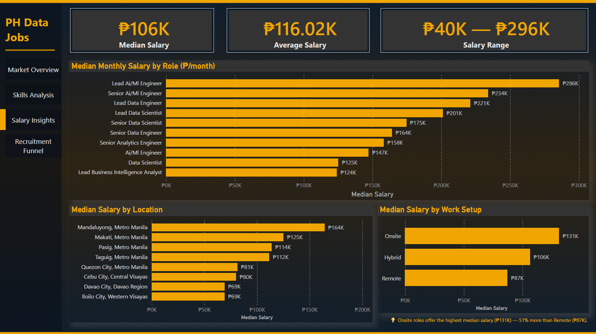
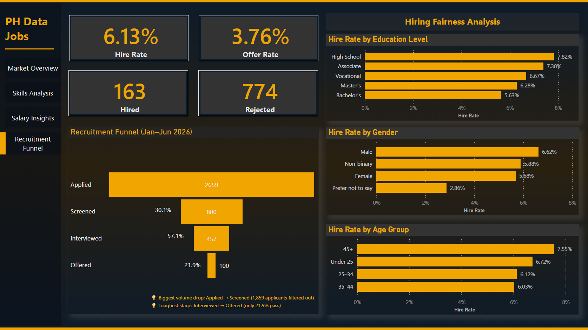

# Philippine Data Job Market Dashboard
**Personal Portfolio Project · Power BI · 2026**

> *"I built an end-to-end Power BI dashboard analyzing the Philippine data job market — covering market trends, in-demand skills, salary benchmarks, and hiring funnel performance — starting from two raw messy CSV files and ending with an interactive four-page dashboard."*

> **Note:** This project uses a **synthetic dataset** generated for learning purposes. All company names are fictional Filipino startup-style names. No real applicant PII is included. The data is intentionally messy to simulate real-world cleaning challenges.

---

## Problem Statement

The Philippine data and analytics job market is growing rapidly but fragmented. Job seekers, hiring managers, and career coaches lack a consolidated view of what roles exist, what they pay, what skills are required, and how competitive the hiring process actually is.

Without this visibility:
- Job seekers apply blindly without knowing which skills to prioritize
- Companies benchmark salaries without market context
- No one knows where demand is actually concentrated

This dashboard addresses that gap by turning raw hiring data into actionable insights across four key areas: market landscape, skills demand, salary benchmarks, and recruitment funnel performance.

---

## Questions Answered

**Market** — What does the landscape look like?
- Which data roles are most in demand in the Philippines?
- Which companies are hiring the most, and where?
- How is the market split between Remote, Hybrid, and Onsite?
- How has job posting volume changed month over month?

**Skills** — What do employers actually want?
- Which technical skills appear most frequently in job postings?
- Which skills are role-specific vs universal across all data jobs?
- What skill combinations should a job seeker prioritize?

**Salary** — What does the market pay?
- What is the median monthly salary for each data role in PHP?
- Do Remote jobs pay more than Onsite?
- What is the typical salary range (min to max) per role?

**Recruitment Funnel** — How competitive is hiring?
- Out of every 100 applicants, how many get hired?
- Where does the biggest drop-off happen in the funnel?
- Is the hiring process equitable across gender, education, and age?

---

## 💡 Key Findings

- Only **6.1% of applicants** were hired — the market is highly competitive
- **Biggest funnel drop-off:** Applied → Screened (only 30.1% pass initial screening)
- **Toughest stage:** Interviewed → Offered (only 21.9% of interviewed candidates get an offer)
- **Remote jobs dominate** at 44%, followed by Hybrid (33%) and Onsite (23%)
- **Onsite roles pay more** — median ₱131K vs Remote ₱87K (counterintuitive finding)
- **Lead AI/ML Engineer** is the highest paying role at ₱286K/month median
- **Mandaluyong, Metro Manila** offers the highest median salary by location at ₱164K
- **Data Analyst** is the most posted role; **SQL** is the most demanded skill (61 postings)
- **Full-time roles** make up 67% of all postings
- **May 2026** had the highest posting volume; **February** the lowest
- Hiring outcomes show **near-parity across demographic groups** — no significant bias detected
- SQL, Python, and Power BI together cover the widest range of roles

---

## Dashboard Pages

| Page | Questions it answers |
|---|---|
| **Market Overview** | Which roles, companies, and locations dominate? How are postings trending? |
| **Skills Analysis** | Which skills are most in demand? Which are role-specific? |
| **Salary Insights** | What does each role pay? Does work setup affect salary? |
| **Recruitment Funnel & Fairness** | How competitive is hiring? Is the process equitable? |

---

## Tools & Technical Skills

| Tool / Skill | What I did with it |
|---|---|
| **Power BI Desktop** | Built all 4 dashboard pages with interactive visuals and slicers |
| **Power Query (M language)** | Cleaned and transformed raw messy CSV data |
| **DAX** | Wrote 20+ measures — CALCULATE, DIVIDE, MEDIAN, time intelligence |
| **Data modeling** | Designed a star schema with 5 tables and 4 relationships |
| **Canva** | Designed custom gradient background for the dashboard |

---

## Data Cleaning Highlights

The raw data had several real-world messiness issues:

- **Mixed date formats** — 4 different formats in one column → parsed to uniform Date type using custom M formula
- **Free-text salary** — formats like `₱115.0K - ₱147.0K /mo` and `PHP 126,000-161,000 monthly` → extracted `salary_min`, `salary_max`, `salary_midpoint` as whole PHP numbers
- **Inconsistent categoricals** — `WFH`, `remote`, `On-site` all meaning the same thing → standardized to 3 values
- **Embedded skills** — skills hidden inside `job_description` free text → extracted into `skills_raw` column
- **Duplicate rows** — 4 duplicate `job_id` rows removed

👉 **[Open the Power Query Cleaning Guide](https://jannellecandelaria.github.io/ph-job-market-analytics/PowerQuery_Cleaning_Guide.html)**

---

## Data Model

Star schema with 5 tables and 4 relationships:

- `fact_applications` — one row per application (2,659 rows)
- `dim_jobs` — one row per job posting (100 rows)
- `dim_skills` — one row per unique skill
- `bridge_job_skills` — many-to-many link between jobs and skills
- `dim_date` — calendar table for time intelligence (Jan–Jun 2026)

👉 **[Open the Data Modeling Guide](https://jannellecandelaria.github.io/ph-job-market-analytics/DataModeling_Guide.html)**

---

## DAX Measures

20+ measures covering funnel KPIs, salary analysis, skills demand, hiring fairness, and time intelligence.

👉 **[Open the DAX Measures Guide](https://jannellecandelaria.github.io/ph-job-market-analytics/DAX_Measures_Guide.html)**

---
 
## Build Documentation
 
Every phase of this project is documented as an interactive step-by-step guide — including the reasoning behind each decision. All guides are in the `/docs` folder.
 
| Guide | What it covers |
|---|---|
| [Power Query Cleaning Guide](https://jannellecandelaria.github.io/ph-job-market-analytics/docs/PowerQuery_Cleaning_Guide.html) | Assessing data quality, all cleaning steps for both tables |
| [Data Modeling Guide](https://jannellecandelaria.github.io/ph-job-market-analytics/docs/DataModeling_Guide.html) | Star schema design, dim/fact decisions, relationships |
| [DAX Measures Guide](https://jannellecandelaria.github.io/ph-job-market-analytics/docs/DAX_Measures_Guide.html) | Filter context, all 20+ measures explained |
| [Dashboard Design Guide](https://jannellecandelaria.github.io/ph-job-market-analytics/docs/Dashboard_Design_Guide.html) | Building all 4 pages, chart types, formatting |

---

## Dashboard Screenshots

### Page 1 — Market Overview

### Page 2 — Skills Analysis

### Page 3 — Salary Insights

### Page 4 — Recruitment Funnel & Fairness

---

## Repository Contents
 
**Dashboard files:**
 
| File | Description |
|---|---|
| `PH_Job_Market_Analytics.pbix` | Power BI Desktop file — full dashboard with all data, measures and visuals |
| `PH_Job_Market_Analytics_Dashboard.pdf` | Exported PDF — all 4 dashboard pages for viewing without Power BI |
| `raw_job_postings.csv` | Raw dataset — 100 job postings |
| `raw_applications.csv` | Raw dataset — 2,659 applications |
| `DATA_DICTIONARY.md` | Column definitions and data notes for both datasets |
 
**Screenshots:**
 
| File | Description |
|---|---|
| `page1_market_overview.png` | Screenshot — Market Overview page |
| `page2_skills_analysis.png` | Screenshot — Skills Analysis page |
| `page3_salary_insights.png` | Screenshot — Salary Insights page |
| `page4_recruitment_funnel.png` | Screenshot — Recruitment Funnel & Fairness page |
 
**Build Documentation (`/docs` folder):**
 
| File | Description |
|---|---|
| `docs/PowerQuery_Cleaning_Guide.html` | Interactive guide — data cleaning in Power Query |
| `docs/DataModeling_Guide.html` | Interactive guide — star schema and relationships |
| `docs/DAX_Measures_Guide.html` | Interactive guide — DAX measures explained |
| `docs/Dashboard_Design_Guide.html` | Interactive guide — building the 4 dashboard pages |
| `docs/Slicer_Guide.html` | Interactive guide — adding slicers to the sidebar |
 
---

## Project Status

| Phase | Status |
|---|---|
| Phase 1 — Data Cleaning (Power Query) | Complete |
| Phase 2 — Data Modeling (Star Schema) | Complete |
| Phase 3 — DAX Measures | Complete |
| Phase 4 — Dashboard Design | Complete |

---

## About

Hi, I'm **Jannelle** — a data analyst based in the Philippines. This is my first end-to-end Power BI portfolio project. I'm documenting every phase as I build it, including the reasoning behind each decision.

Connect with me on [LinkedIn](https://www.linkedin.com/in/jnnllcandelaria/)

---

*Data is synthetic and generated for learning purposes. Company names are fictional Filipino startup-style names. No real applicant PII is included.*
